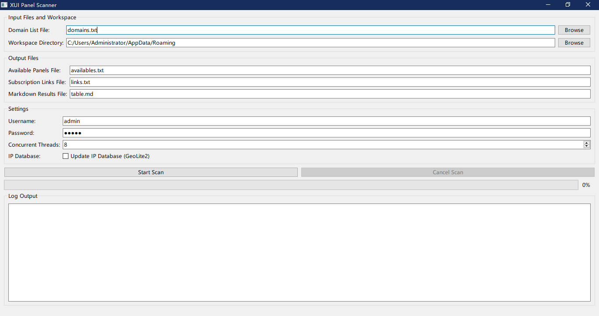

### 免责申明
+ 本项目仅用作学习爬虫技术，请勿滥用，不要通过此工具做任何违法乱纪或有损国家利益之事
+ 禁止使用该项目进行任何盈利活动，对一切非法使用所产生的后果，本人概不负责

## 功能
+ 在原版的基础上增加了GUI，实现Password, Username, Threads的GUI控制
## 维护
+ 周末吧，欢迎大家issue和PR
# X-UI面板地址扫描
fofa：
<u>https://channel.rclogs.com/posts/41<u>
((app="3x-ui" || app="x-ui"))
censys:
393eccffeeb74e8d336cc470a44ef957b5090d53
>>>>>>> c240b8242173a70eb436c13e8c28836ccd4dfb63
## ⭐ Star 星星走起

## 🙏 致谢
1. <u>(https://github.com/wzdnzd/aggregator)</u>
2. <u>(https://blog-next-js.pages.dev/blog/%E6%89%AB%E6%8F%8F%E7%BB%93%E6%9E%9C)</u>
3. Gemini，Google
